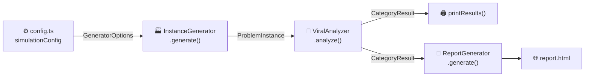
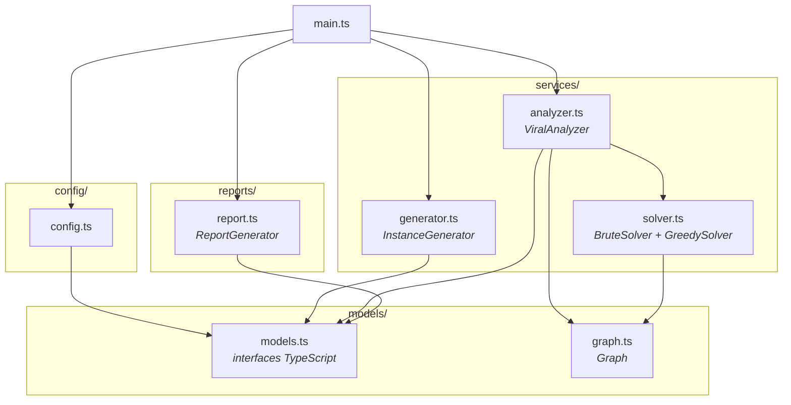
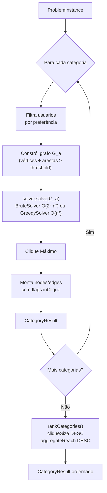

# Click Problem


> Ferramenta educacional para explorar o **Problema do Clique Máximo** aplicado a redes sociais. Dado um conjunto de criadores com interesses em comum, o sistema encontra em cada categoria o maior grupo cujas audiências se sobrepõem (clique) — os influenciadores que, endossando o mesmo produto, disparam **prova social / efeito manada** (*bandwagon*) e maximizam a adesão. Resolve por força bruta (exato) **e** por heurística gulosa, e gera um relatório HTML interativo com grafos e gráficos comparativos.

---

## O que é o Problema do Clique?

Um **clique** em um grafo é um subconjunto de vértices onde todos se conectam entre si. Encontrar o maior desses subgrupos é o **Problema do Clique Máximo** — um problema NP-Completo clássico da teoria da computação (Karp, 1972).

Neste projeto, o problema é modelado assim:

- Cada **usuário/criador** é um vértice com categorias de interesse e número de seguidores.
- Dois criadores são conectados por uma **aresta** quando o score de **sobreposição de audiência** entre eles supera um limiar configurável.
- O algoritmo encontra o maior clique em cada categoria: o maior grupo de criadores que atingem a mesma audiência.

### Por que o *maior* clique? (prova social)

Um usuário adere muito mais a um produto quando **vários criadores que ele segue o endossam ao mesmo tempo** — é o efeito manada. Num clique de tamanho `k`, o público compartilhado recebe `k` endossos simultâneos, e a adesão esperada segue a **curva de adesão**:

```
p(adesão) = 1 − (1 − q)^k     # q = adesão por endosso único (ex.: 0,15); k = tamanho do clique
```

Com `q = 0,15`: 1 criador → 15%; 4 criadores → ~48%. Maximizar o clique maximiza a adesão — daí buscar o clique **máximo**.

### Algoritmos

Dois solvers intercambiáveis pela interface `CliqueAlgorithm`:

- **`BruteSolver`** — força bruta exata com *early exit*, `O(2ⁿ · n²)`. Garante o ótimo; viável até ~25 vértices por categoria.
- **`GreedySolver`** — heurística gulosa por grau, `O(n²)`, determinística. Escala, sem garantia de ótimo. Base do comparativo baseline × heurística (desempenho × qualidade).

---

## Pré-requisitos

- **Node.js 18+** e **npm 9+**
- Nenhuma outra dependência além das instaladas por `npm install`

---

## Instalação

```bash
git clone https://github.com/pumba-dev/click-problem.git
cd click-problem
npm install
```

---

## Uso

```bash
npm start        # executa a simulação e gera report.html (embute bench.json se existir)
npm run bench    # gera bench.json — comparativo força bruta × heurística por tamanho de entrada
npm test         # roda a suíte de testes unitários
npm run build    # compila TypeScript para dist/
```

`npm start` executa a simulação com os parâmetros de `src/config/config.ts`, imprime o ranking no terminal e gera `report.html` na raiz. Abra esse arquivo em qualquer navegador para ver os grafos interativos e gráficos comparativos. Rode `npm run bench` antes para popular a aba **Benchmark** com dados reais do comparativo baseline × heurística.

---

## Como funciona

### Visão geral do fluxo



### Arquitetura de módulos



### Pipeline interno do ViralAnalyzer



---

## Configuração da Simulação

Todas as configurações estão centralizadas em **[src/config/config.ts](src/config/config.ts)**. Edite esse arquivo e rode `npm start` novamente.

```typescript
export const simulationConfig: GeneratorOptions = {
  seed: 42,          // semente do PRNG — mesma seed = mesma instância
  numUsers: 30,      // total de usuários na rede simulada
  categories: [      // categorias de conteúdo avaliadas
    "animals", "sports", "technology", "music", "food"
  ],
  prefProb: 0.5,     // prob. de um usuário gostar de cada categoria (0–1)
  threshold: 0.6,    // limiar mínimo de interação para criar uma aresta (0–1)
  reachLow: 1_000,   // alcance mínimo de seguidores por usuário
  reachHigh: 500_000 // alcance máximo de seguidores por usuário
};

export const reportOutputPath = "report.html";
```

### Parâmetros principais

| Parâmetro | Efeito |
| --- | --- |
| `seed` | Troque para explorar cenários diferentes mantendo reprodutibilidade |
| `numUsers` | Padrão 30. O baseline (força bruta O(2ⁿ · n²)) fica lento quando um grafo por categoria passa de ~22 vértices; com os padrões o maior fica ≤ 20 |
| `categories` | Adicione ou remova categorias livremente |
| `threshold` | Menor valor = grafos mais densos = cliques potencialmente maiores |
| `prefProb` | Maior valor = mais usuários elegíveis por categoria = grafos maiores |

> **Atenção:** O baseline é força bruta (educacional). O padrão de 30 usuários roda em segundos (grafos por categoria ≲ 20 vértices); acima de ~22 vértices por categoria (`numUsers`/`prefProb` altos) o tempo cresce como O(2ⁿ) — nesses casos use o `GreedySolver` (heurística O(n²)).

---

## Relatório HTML

O arquivo `report.html` gerado contém:

| Aba | Conteúdo |
| --- | --- |
| **Visão Geral** | Ranking, gráficos de clique/alcance por categoria e a **curva de adesão** (prova social, `p = 1 − (1−q)^k`) |
| **Usuários** | Tabela com todos os usuários, seguidores e preferências por categoria |
| **Interações** | Grafo global de todos os usuários com arestas coloridas pelo score de interação |
| **Benchmark** | Comparativo **força bruta × heurística** por tamanho de entrada: tempo×n (escala log), acerto do ótimo e trade-off aceleração×qualidade (destaca casos subótimos-porém-rápidos). Requer `npm run bench` |
| **`<Categoria>`** | Grafo interativo (vis.js) com membros do clique destacados em laranja |
| **Estatísticas** | Metadados da simulação (seed, config), tempos de processamento por fase, densidade da rede e esforço computacional do solver por categoria |

Nos grafos: nós **laranja** = membros do clique máximo; nós **azuis** = demais usuários elegíveis. Arestas laranjas conectam membros do clique entre si.

---

## Estrutura do Projeto

```text
src/
├── main.ts                  Orquestração — instancia e encadeia as classes
├── config/
│   └── config.ts            Configurações da simulação — edite aqui
├── models/
│   ├── models.ts            Interfaces TypeScript (User, ProblemInstance, SimulationStats, etc.)
│   └── graph.ts             Graph — lista de adjacência com sets
├── services/
│   ├── generator.ts         InstanceGenerator — geração aleatória reprodutível (PRNG Mulberry32)
│   ├── analyzer.ts          ViralAnalyzer — constrói grafos, executa solver e rankeia
│   └── solver.ts            BruteSolver (força bruta exata) + GreedySolver (heurística gulosa) — interface CliqueAlgorithm
├── bench/
│   └── benchmark.ts         Harness (atividade 7) — força bruta × heurística por tamanho de entrada → bench.json
├── reports/
│   └── report.ts            ReportGenerator — gera o relatório HTML e compila SimulationStats
└── __tests__/               Testes unitários (vitest)
    ├── graph.test.ts
    ├── solver.test.ts
    ├── greedy.test.ts
    ├── benchmark.test.ts
    ├── generator.test.ts
    └── analyzer.test.ts
```

---

## Referências Acadêmicas

- Cormen et al. _Introduction to Algorithms_, 4ª ed. MIT Press, 2022. §34.5.1.
- Karp, R. M. "Reducibility among combinatorial problems." 1972.
- Bron, C.; Kerbosch, J. "Finding all cliques of an undirected graph." _CACM_, 1973.
- Cialdini, R. B. _Influence: The Psychology of Persuasion_. Harper Business, 2006. (prova social)
- Leibenstein, H. "Bandwagon, Snob, and Veblen Effects in the Theory of Consumers' Demand." _QJE_, 1950. (efeito manada)

---

## Licença

Copyright © 2026 [Pumba Developer](https://github.com/pumba-dev)
