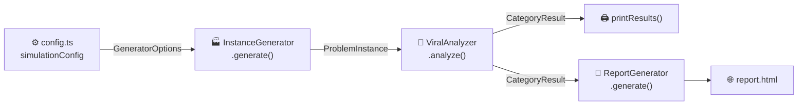
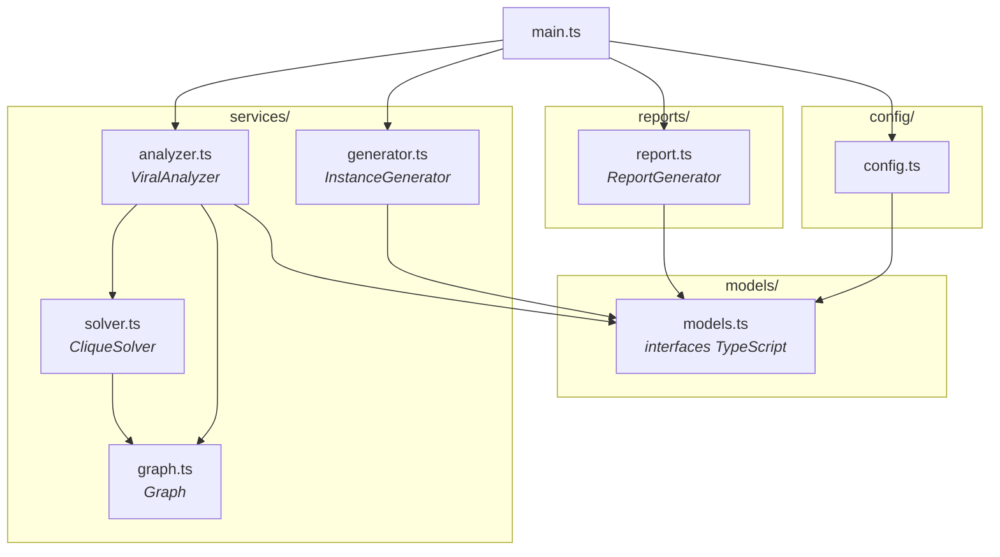
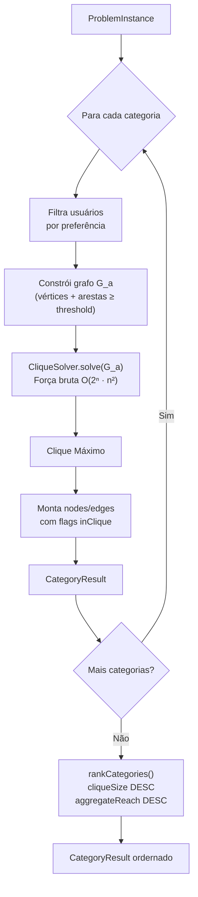

# Click Problem


> Ferramenta educacional para explorar o **Problema do Clique Máximo** aplicado a redes sociais. Dado um conjunto de usuários com interesses em comum, o sistema encontra o maior grupo coeso (clique) em cada categoria de conteúdo e rankeia as melhores oportunidades de seed viral — gerando um relatório HTML interativo com grafos e gráficos comparativos.

---

## O que é o Problema do Clique?

Um **clique** em um grafo é um subconjunto de vértices onde todos se conectam entre si. Encontrar o maior desses subgrupos é o **Problema do Clique Máximo** — um problema NP-Completo clássico da teoria da computação (Karp, 1972).

Neste projeto, o problema é modelado assim:

- Cada **usuário** é um vértice com categorias de interesse e número de seguidores.
- Dois usuários são conectados por uma **aresta** quando o score de interação entre eles supera um limiar configurável.
- O algoritmo encontra o maior clique em cada categoria: o grupo mais coeso para um seed viral.

---

## Pré-requisitos

- **Node.js 18+** e **npm 9+**
- Nenhuma outra dependência além das instaladas por `npm install`

---

## Instalação

```bash
git clone https://github.com/pumba-dev/click-problem.git
cd click-problem
npm install
```

---

## Uso

```bash
npm start        # executa a simulação e gera report.html
npm test         # roda a suíte de testes unitários
npm run build    # compila TypeScript para dist/
```

`npm start` executa a simulação com os parâmetros de `src/config/config.ts`, imprime o ranking no terminal e gera `report.html` na raiz. Abra esse arquivo em qualquer navegador para ver os grafos interativos e gráficos comparativos.

---

## Como funciona

### Visão geral do fluxo



### Arquitetura de módulos



### Pipeline interno do ViralAnalyzer



---

## Configuração da Simulação

Todas as configurações estão centralizadas em **[src/config/config.ts](src/config/config.ts)**. Edite esse arquivo e rode `npm start` novamente.

```typescript
export const simulationConfig: GeneratorOptions = {
  seed: 42,          // semente do PRNG — mesma seed = mesma instância
  numUsers: 30,      // total de usuários na rede simulada
  categories: [      // categorias de conteúdo avaliadas
    "animals", "sports", "technology", "music", "food"
  ],
  prefProb: 0.5,     // prob. de um usuário gostar de cada categoria (0–1)
  threshold: 0.6,    // limiar mínimo de interação para criar uma aresta (0–1)
  reachLow: 1_000,   // alcance mínimo de seguidores por usuário
  reachHigh: 500_000 // alcance máximo de seguidores por usuário
};

export const reportOutputPath = "report.html";
```

### Parâmetros principais

| Parâmetro | Efeito |
| --- | --- |
| `seed` | Troque para explorar cenários diferentes mantendo reprodutibilidade |
| `numUsers` | Mantenha abaixo de ~25 — o solver é força bruta O(2ⁿ · n²) |
| `categories` | Adicione ou remova categorias livremente |
| `threshold` | Menor valor = grafos mais densos = cliques potencialmente maiores |
| `prefProb` | Maior valor = mais usuários elegíveis por categoria = grafos maiores |

> **Atenção:** O algoritmo é força bruta e serve para fins educacionais. Para `numUsers > 25`, o tempo de execução pode ser longo.

---

## Relatório HTML

O arquivo `report.html` gerado contém:

| Aba | Conteúdo |
| --- | --- |
| **Visão Geral** | Gráficos de barras comparando tamanho do clique e alcance por categoria |
| **Usuários** | Tabela com todos os usuários, seguidores e preferências por categoria |
| **`<Categoria>`** | Grafo interativo (vis.js) com membros do clique destacados em laranja |

Nos grafos: nós **laranja** = membros do clique máximo; nós **azuis** = demais usuários elegíveis. Arestas laranjas conectam membros do clique entre si.

---

## Estrutura do Projeto

```text
src/
├── main.ts                  Orquestração — instancia e encadeia as classes
├── config/
│   └── config.ts            Configurações da simulação — edite aqui
├── models/
│   └── models.ts            Interfaces TypeScript (User, ProblemInstance, etc.)
├── services/
│   ├── generator.ts         InstanceGenerator — geração aleatória reprodutível (PRNG Mulberry32)
│   ├── analyzer.ts          ViralAnalyzer — constrói grafos, executa solver e rankeia
│   ├── solver.ts            CliqueSolver — força bruta com early exit
│   ├── graph.ts             Graph — lista de adjacência com sets
│   └── __tests__/           Testes unitários (vitest)
│       ├── graph.test.ts
│       ├── solver.test.ts
│       ├── generator.test.ts
│       └── analyzer.test.ts
└── reports/
    └── report.ts            ReportGenerator — gera o relatório HTML interativo
```

---

## Referências Acadêmicas

- Cormen et al. _Introduction to Algorithms_, 4ª ed. MIT Press, 2022. §34.5.1.
- Karp, R. M. "Reducibility among combinatorial problems." 1972.
- Bron, C.; Kerbosch, J. "Finding all cliques of an undirected graph." _CACM_, 1973.

---

## Licença

Copyright © 2026 [Pumba Developer](https://github.com/pumba-dev)
